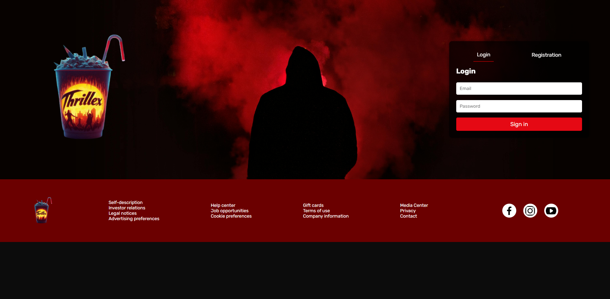

# Code Week Thrillex

## 📸 Screenshot


## 🚀 Panoramica del Progetto

**Code Week Thrillex** è un'iniziativa progettata per rendere la programmazione accessibile e divertente attraverso un'esperienza interattiva e coinvolgente. Il progetto utilizza una combinazione di **HTML**, **CSS** e **JavaScript** per creare una piattaforma che ispira i principianti a esplorare il mondo del codice durante la Code Week.

## 🛠️ Tecnologie Utilizzate

- **HTML**: Struttura di base delle pagine web.
- **CSS**: Stilizzazione e layout.
- **JavaScript**: Funzionalità interattive e dinamiche.
- **Figma**: Utilizzato per la progettazione del layout grafico.

## 📂 Struttura del Progetto

Il repository è organizzato nelle seguenti sezioni principali:

- `index.html`: La pagina principale del progetto.
- `style.css`: Il file CSS per la stilizzazione del sito.
- `index.js`: Contiene la logica JavaScript per l'interattività.
- `images/`: Cartella contenente tutte le immagini utilizzate nel progetto.
- `figma/`: File del progetto grafico.
- `film/`: File multimediali inclusi nel progetto.

## 🎨 Funzionalità Principali

- **Layout Interattivo**: Esperienza utente coinvolgente grazie all'integrazione di video e interazioni dinamiche.
- **Design Responsivo**: Progettato per adattarsi a diversi dispositivi, garantendo un'esperienza uniforme su mobile, tablet e desktop.
- **Gestione di Carte**: Funzionalità specifica per la visualizzazione e gestione delle carte informative nel progetto.

## 🚀 Come Iniziare

Per ottenere una copia locale del progetto e avviarlo, segui questi passaggi:

1. **Clona il repository:**
   ```bash
   git clone https://github.com/aniaBeninati/code-week-thrillex.git
